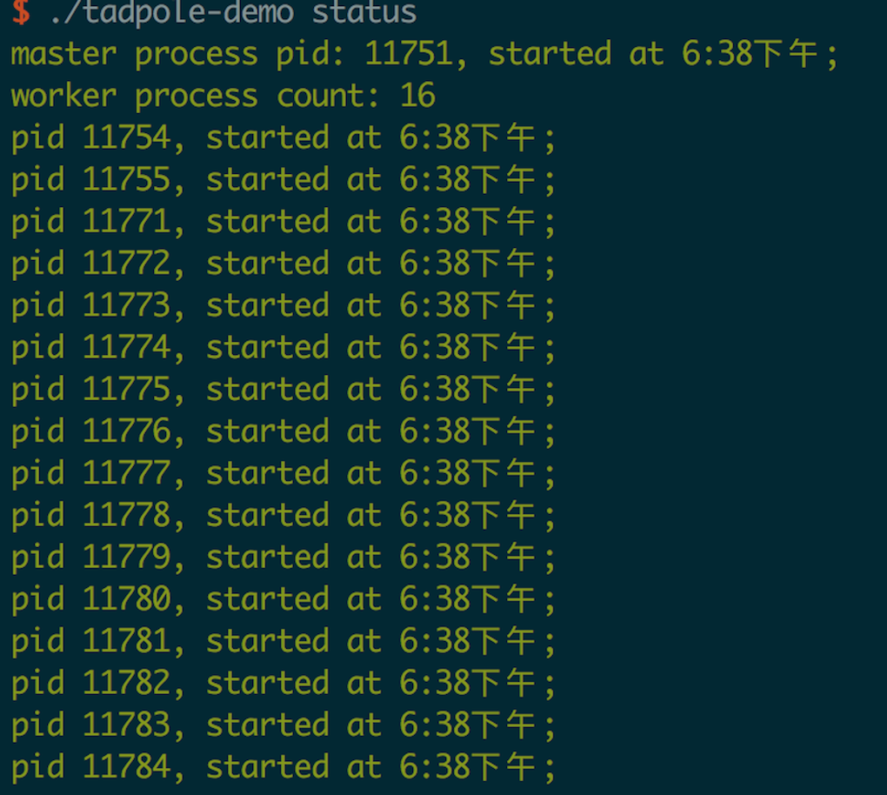

# tadpole 文档

> tadpole 是一个flask starter 项目。从平时flask项目的开发过程中提出来的一些通用的功能,如通过gunicorn管理flask应用的配置文件和启动脚本,初始化virtualenv环境同时安装必要的依赖库,生成flask secret以及提供restful route, 自动为sqlalchey model注册restful接口, 登录认证,权限管理, restful支持等等技能。

## 一、系统和环境要求

`posix, Python 2.x >= 2.6`

## 二、 安装方法

`pip install tadpole`

## 三、 使用方法
`tadpole init -n PROJECT_NAME -v PROJECT_VERSION -o PROJECT_OWNER -e PROJECT_EMAIL`

其中`PROJECT_NAME`是初始化的项目名,`PROJECT_VERSION`是初始化的版本号(默认为0.0.1), `PROJECT_OWNER`为项目负责人,
`PROJECT_EMAIL`为项目邮件组(用于接收邮件)。

也可以直接执行`tadpole init` 会提示填入项目名,其他采用默认, 例如:

## 四、项目结构

至此,已经使用tadpole初始化了一个新的flask项目,进入tadpole-demo目录可以看到

* requirements.txt 新项目依赖第三方库列表(其中包含了flask项目常用依赖库)
* venv 为新项目生成的virtualenv 环境,其中已经安装了requirements.txt中声明的依赖项
* main.py 项目入口文件,其中定义了Flask app
* app 主要代码目录
* config.py 配置文件(会上传git,主要包含不涉秘配置项)
* instance 其中由instance/config.py, 本地配置项,已经加入.gitignore, 不会上传git,其中为涉密配置或本地特殊配置,其中配置可以覆盖config.py中配置
* gun.py gunicorn配置文件
* data 项目数据目录,已经加入.gitignore
* logs 项目日志目录,已经加入.gitignore
* dev 本地调试管理脚本,由于具有项目的所有权限,因此已经加入.gitignore,仅供本地调试
* tadpole-demo 以项目名gunicorn管理脚本,提供了gunicorn启动/停止/重新加载等技能

## 五、管理脚本的使用

### 5.1 dev的使用
dev是提供给开发者在开发环境下使用的工具,其中提供了如下技能

* create_db: 根据model自动生成表结构
* url: 展示所有注册url
* clean: 删除项目目录下所有pyc,pyo文件
* shell: 以命令行方式侵入应用
* runserver: 使用flask内置的web服务器在5000端口启动应用

此处仅以 url 为例:

可以看到新初始化的项目已经有这么多注册的url了,其中prefix为/api/v0.0.1/rest_db开头的url都是为已经创建的
user,role,resource三张表自动生成的restful api。另外一个/health则用于健康检查。最后的/static/则是flask默认提供的。

### 5.2 tadpole-demo的使用
* start 用gunicorn启动flask应用,如:

* status 用于显示gunicorn应用状态,如:

* stop 用于停止gunicorn应用
* reload 用于重新加载gunicorn配置文件,同时重新启动worker进程(目前只支持linux,不支持mac)

## 六、提供的基本技能

### 6.1 sqlalchemy restful model
工作中经常会有人要接口查询数据,但是很多数据只需要执行sql语句就能拿到数据,但是又不能直接把DB权限给别人,
因此提供了一个把简单sql语句自动对应到restful查询的技能。这个技能实际上市面上已经有很多库提供了,但是
并没有遇到让我自己用的很舒服的库,因此自己写了一个,这个技能之只需要用户写Model类,并直接或间接的
import到app/models/__init__.py中即可为其自动注册restful接口。

为了初始化出来的项目可以开箱即用, 会给默认的db(sqlite数据库,文件位于app.db)中创建user,role,resource等
表结构,同时会插入部分数据,因此访问已经注册的rest_db url是可以直接拿到数据的, 例如:

	curl http://127.0.0.1:8080/api/v0.0.1/rest_db/user 
	
	{
	    "code": 200,
	    "msg": "ok",
	    "result": {
	        "next_page": "http://127.0.0.1:8080/api/v0.0.1/rest_db/user?__page=2&__page_size=200",
	        "page": 1,
	        "page_size": 200,
	        "prev_page": null,
	        "result": [
	            {
	                "__roles_link": "http://127.0.0.1:8080/api/v0.0.1/rest_db/user/1/roles",
	                "account": "tadpole",
	                "create_time": "2017-11-26 17:53:13",
	                "email": "tadpole@tadpole.com",
	                "id": 1,
	                "name": "tadpole"
	            }
	        ]
	    }
    }

可以看到user表已经有一条记录了,同时__roles_link链接到了每个用户所拥有的角色，直接访问可以看到

	curl http://127.0.0.1:8080/api/v0.0.1/rest_db/user/1/roles 
	
	
	{
		  "msg": "ok",
		  "code": 200,
		  "result": {
		    "next_page": "http://127.0.0.1:8080/api/v0.0.1/rest_db/user/1/roles?__page=2&__page_size=200",
		    "prev_page": null,
		    "result": [
		      {
		        "description": "super admin",
		        "__resources_link": "http://127.0.0.1:8080/api/v0.0.1/rest_db/role/1/resources",
		        "__users_link": "http://127.0.0.1:8080/api/v0.0.1/rest_db/role/1/users",
		        "create_time": "2017-11-26 17:42:52",
		        "id": 1,
		        "name": "root"
		      }
		    ],
		    "page_size": 200,
		    "page": 1
		 }
	}
	
可以看到tadpole这个用户已经拥有了一个root角色, 每一条记录除了返回自己的的列之外还以`__{relation}_link`的形式返回了其关联关系的链接。

#### 6.1.1 支持的查询条件

	 OPERATORS = ('lt', 'le', 'gt', 'ge', 'eq', 'like', 'in', 'between')
    PROCESSES = ('__show', '__order')
    PAGINATE = ('__page', '__page_size')

    
查询条件分为3类,一类是基本的运算符在OPERATORS中,另一类是对查询的数据进行一些处理,如排序、只展示部分列等,另一类则是分页。
联合使用这些查询条件:

	
	http://127.0.0.1:5000/api/v0.0.1/rest_db/user?name=tadpole&account.like=tad%&__show=account,email&__order=id.asc,name.desc	
	{
	  "msg": "ok",
	  "code": 200,
	  "result": {
	    "next_page": "http://127.0.0.1:5000/api/v0.0.1/rest_db/user?name=tadpole&__page_size=200&__page=2&account.like=tad%25&__order=id.asc%2Cname.desc&__show=account%2Cemail",
	    "prev_page": null,
	    "result": Array[1][
	      {
	        "account": "tadpole",
	        "email": "tadpole@tadpole.com"
	      }
	    ],
	    "page_size": 200,
	    "page": 1
	  }
	}

可以看到仅仅返回了`__show`中列出的列,而且按照`name=tadpole,account.like=tad%`过滤的结果,并且根据`__order`中的排序条件进行了排序。

#### 6.1.2 url规则
可以看出生成的url都是有一定规则的, prefix为/api/v0.0.1,其中v0.0.1是项目的版本号,但是这个是可以定制的。通过配置文件中的`BP_PREFIX`就可以配置每一个bluprint对应的prefix,例如rest_db这个blueprint(即rest model使用的)的配置可以如下:

	BP_PREFIX = {
    'rest_db': '/api/{0}/rest_db/'.format(VERSION)
	}
	

除了prefix之外,后面紧跟着的则是表名,如果是关联查询则是`{prefix}/{table_name}/{pk_id}/{relation_name}`

#### 6.1.3 自动隐藏
并不是所有的列都适合展示,有些列(比如密码,并不适合对外开放),初始化出来的项目对user表的password列就做了隐藏,如下:

	class User(Model):

    # columns in __hide__ does'nt show in rest_db
    __hide__ = ('password',)

    account = Column(
        db.String(128),
        nullable=False,
        default=u'-',
        index=True,
        unique=True)
    name = Column(db.String(32), nullable=False, default=u'-')
    email = Column(db.Email(128), nullable=False, default=u'-')
    password = Column(db.Password(schemes=['pbkdf2_sha512', 'md5_crypt'],
                                  deprecated=['md5_crypt']), nullable=False, default=u'-')

声明Model时, `__hide__`元组中的列不会在自动生成的restful接口中展示

